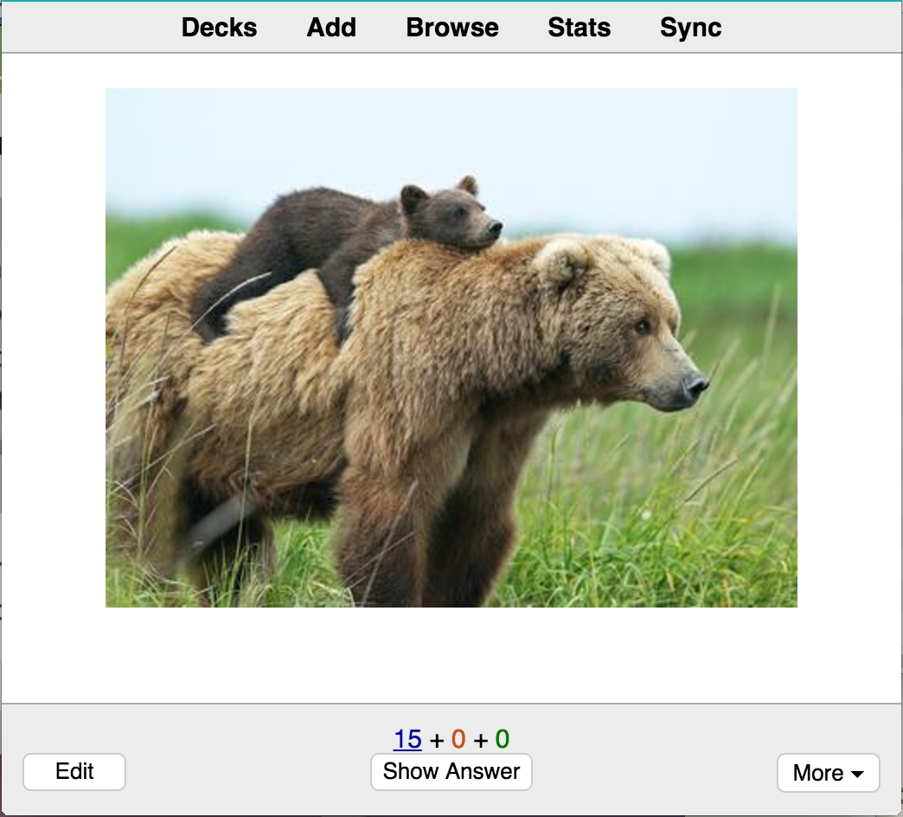
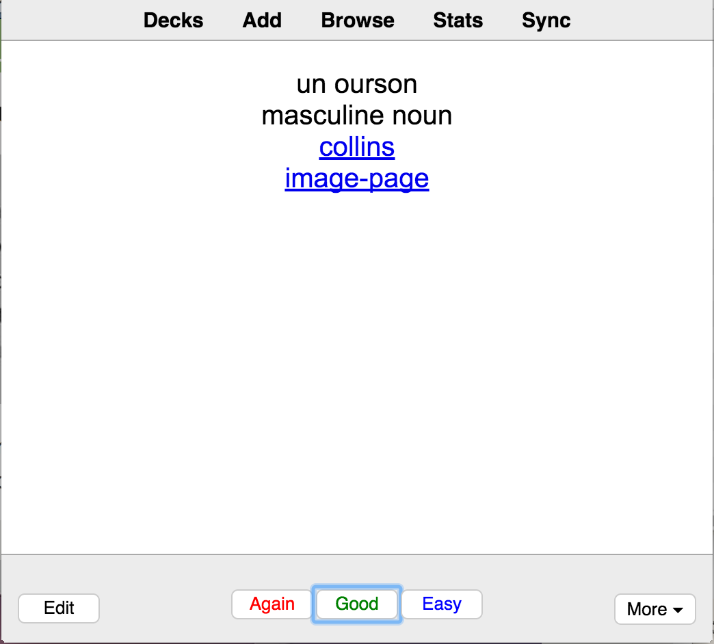
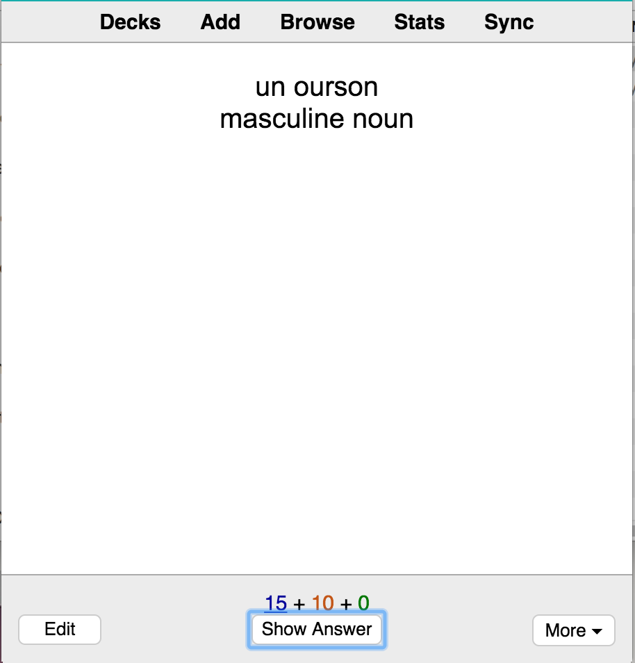
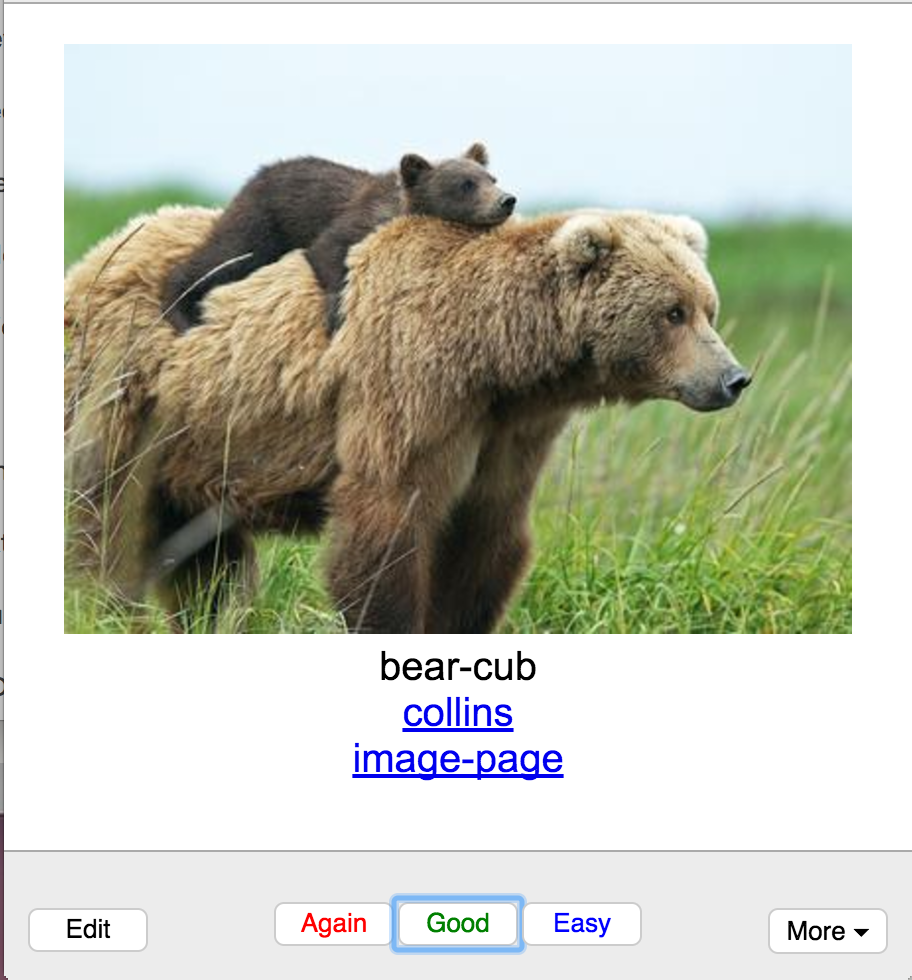
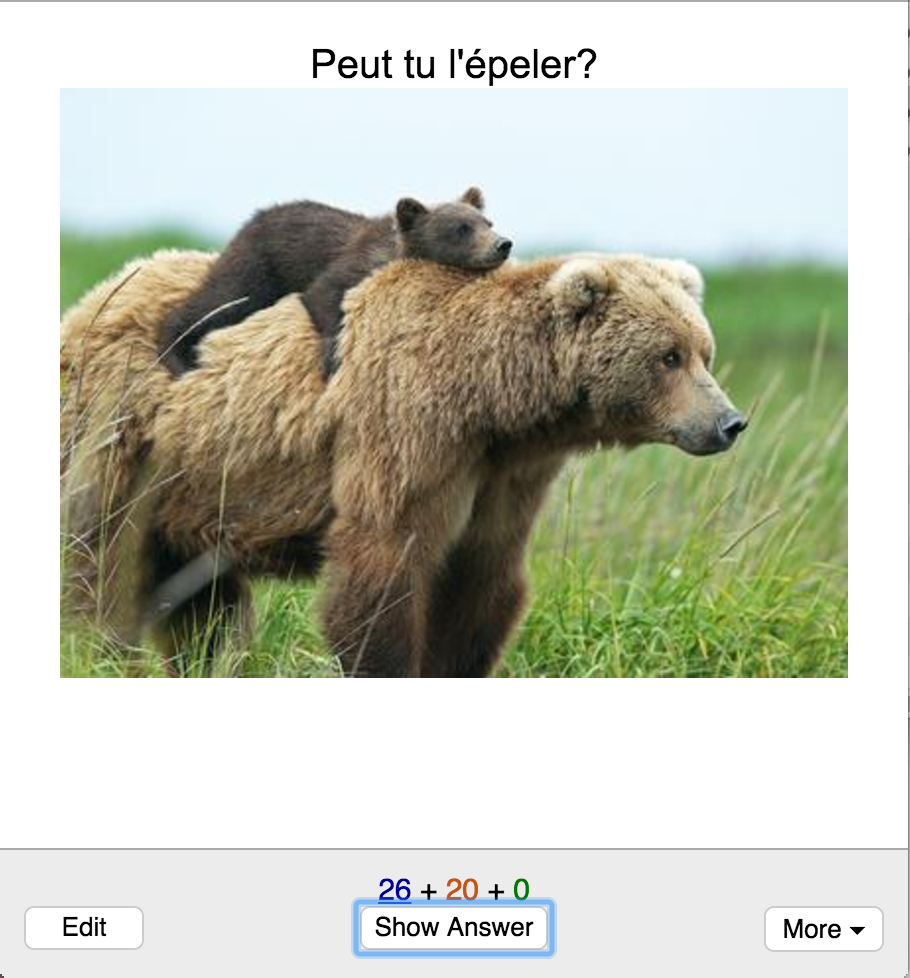
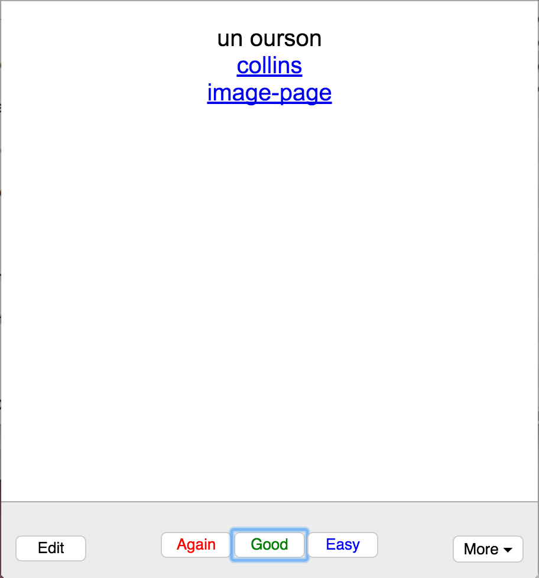
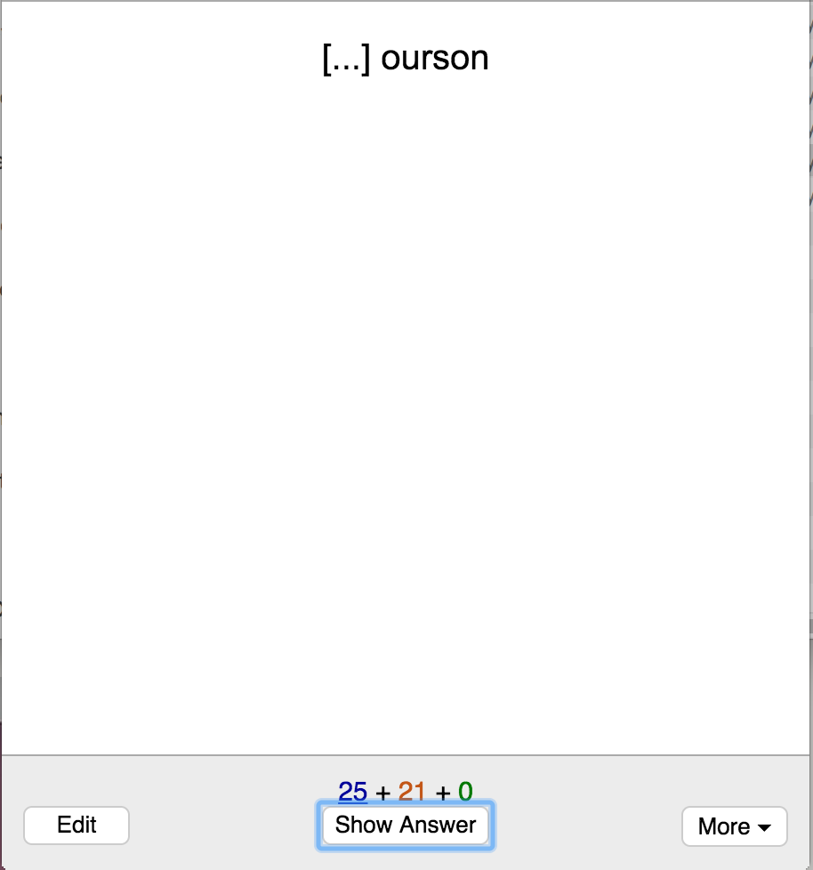
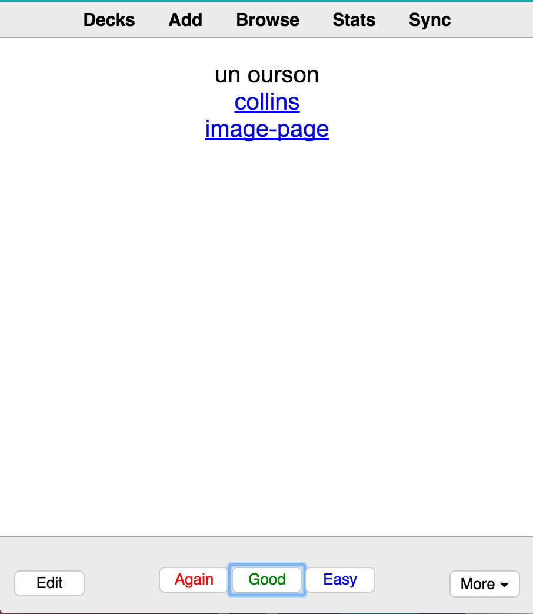
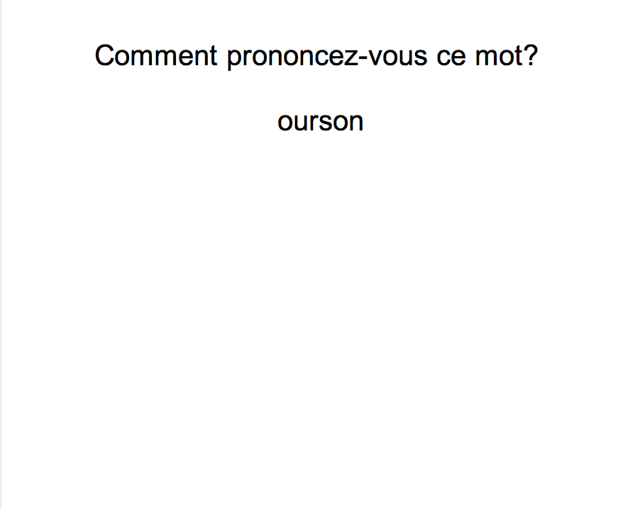
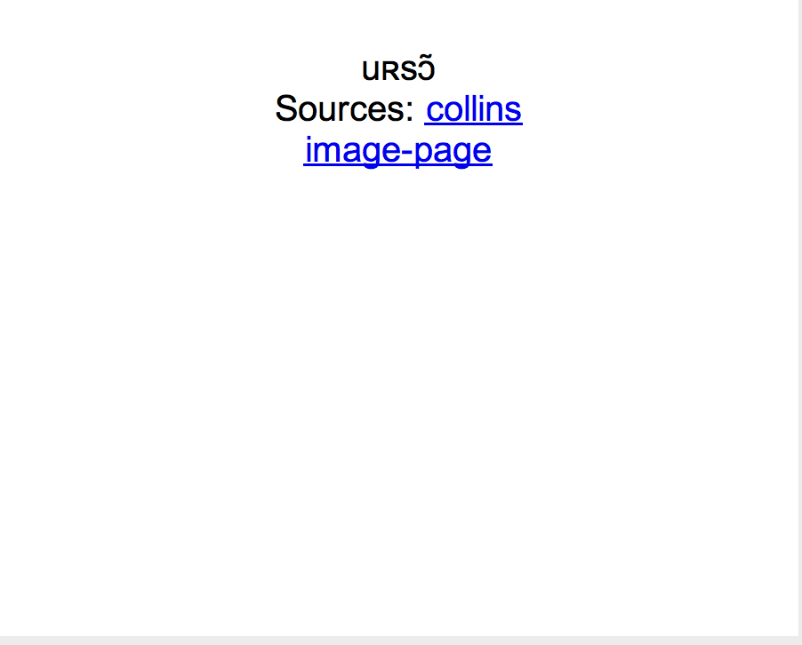

# french-genanki-jupyter
A jupyter notebook for creating French anki cards.  The script loads a csv file of words to search, then it gets data from bing image search api, and collins dictionary.  The script tries to get culture / language specific images. This could be easily adapted to other languages & dictionaries.  

It creates five cards per word for testing:
* comprehension based on the image (without words);
* generation (thinking of the word with a picture cue);
* pronunciation (with audio and IPA);
* spelling; and
* quizzing the gender of nouns.

## Inspiration
*  a [similar project for chinese "pre-study"](https://www.kerrickstaley.com/2018/09/04/chinese-prestudy).
* [Fluent Forever](https://fluent-forever.com/)

## Requirements
* You need to get a [MS Bing Image Search API Key](https://azure.microsoft.com/en-ca/services/cognitive-services/bing-image-search-api/), (which costs about $US 5 per 1000 queries)
  * I tried all sorts of free options, but nothing else worked well.
* you must install the following python libraries:
  * jupyterlab
  * python-resize-image
  * requests
  * BeautifulSoup
  * yaml

## To use:
1. install required libraries
1. save your bing image search api key to bing_settings.yaml file
1. open notebook from jupyter lab
1. run all cells to test fire!

## Example cards

  

 

  

 

  

 

  

 

  

